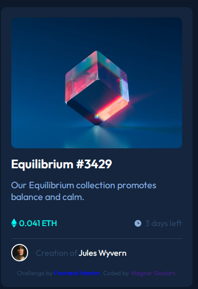

# Frontend Mentor - NFT preview card component solution
 
Solução para o desafio [NFT preview card component challenge on Frontend Mentor](https://www.frontendmentor.io/challenges/nft-preview-card-component-SbdUL_w0U)

 
 
## Tecnologias utilizadas

## Aprendizados e Dificuldades
 
No desafio proposto a imagem possui um Hover na imagem, onde ao passar o mouse deve apecer um icone de visualizaçõ, nunca tinha feito esse tipo de efeito.
Foi algum tempo de pesquisas e testes até o o resultado ficasse o mais próximo com o Layout oferecido.
 
 
